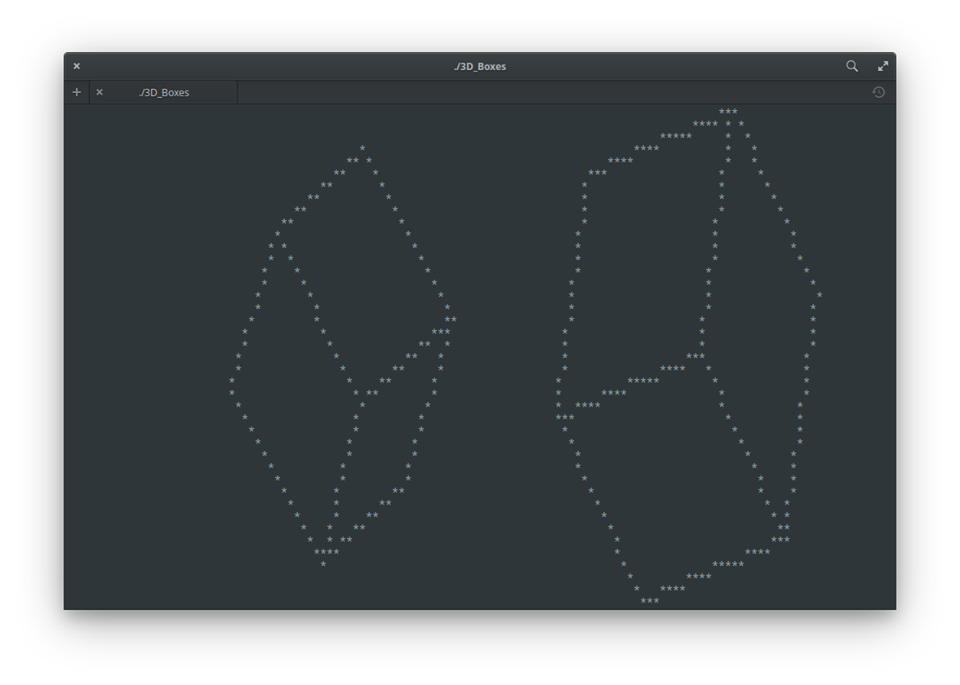

I do not own the ZDK library.

This has only been tested in Cygwin, so I can't guarantee it'll work correctly elsewhere.

Make sure you're in the same folder as the source files when you use the compile command.

Here is the compilation command that I used: gcc *.c -std=gnu99 -I../ZDK -L../ZDK -lzdk -lncurses -lm -o 3D_Boxes

